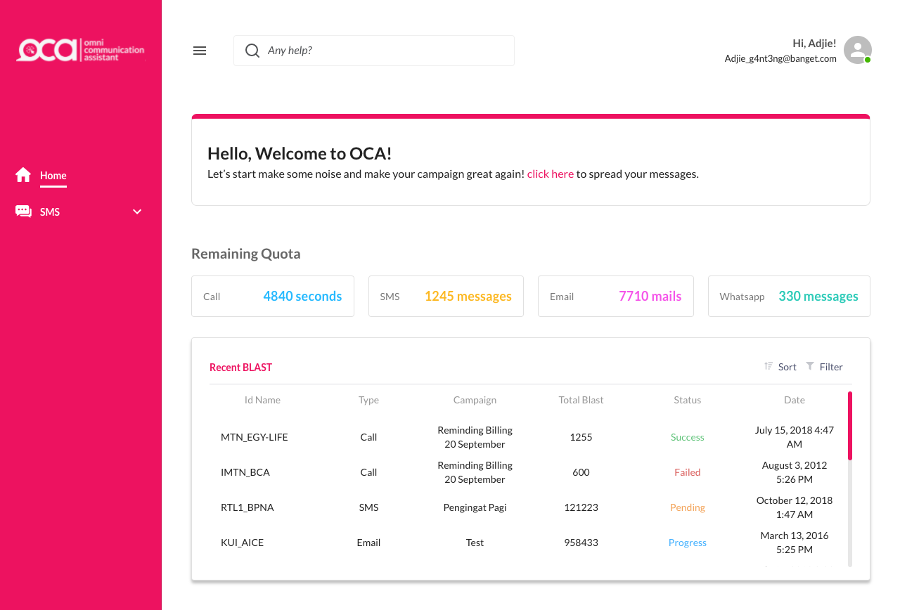
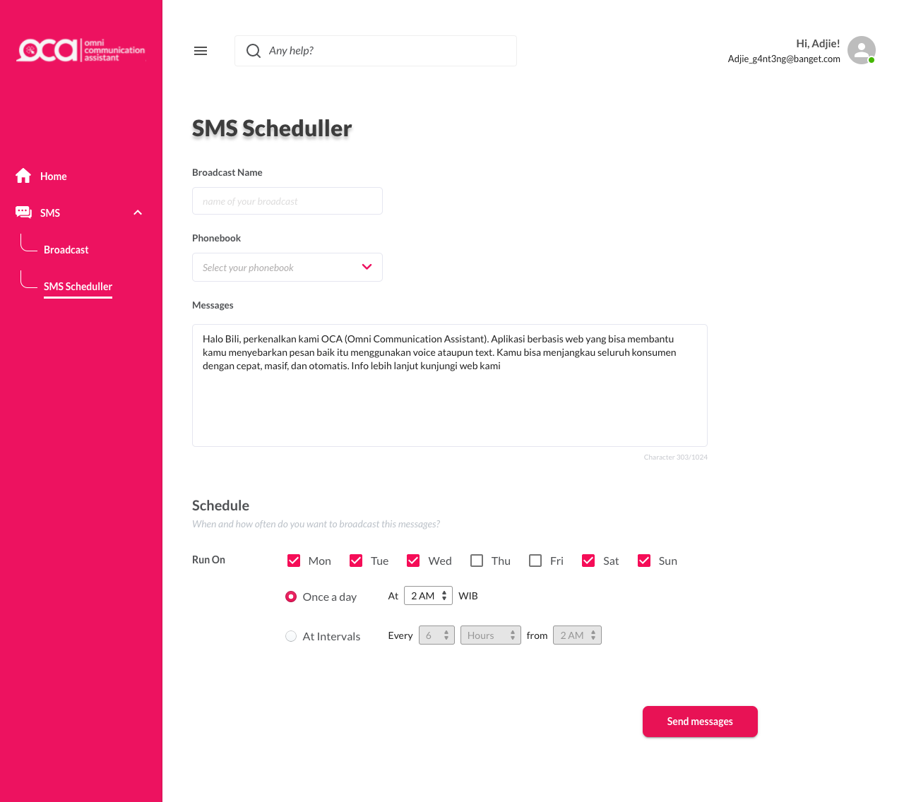

# OCA SMS Broadcast Admin Template with Reactjs

Written entirely with Javascript (reactjs & material-ui).

<br />

Live demo: https://smsbroadcast-alfattah.netlify.app/

<br />

There's three pages of this template

**1. Login (/auth/login)**
<br />


<br />

**2. Home (/dashboard)**
<br />


<br />

**3. SMS Scheduller (/sms/scheduler)**
<br />



<br />

## Installation

**A.Installing Prerequisites**
<br />

Download and install at least LTS or the latest version of [Node.js](https://nodejs.org/) from its web site. 

<br />

**B.Clone SMS Broadcast Template**
<br />

Open your favorite console application (Terminal, Command Prompt etc.), navigate into your work folder, run the following command and wait for it to finish:

<br />

**Using Yarn**

```sh
 git clone https://github.com/alfattahdaeng/oca-sms-broadcast.git
 cd oca-sms-broadcast
 yarn install
 yarn start
```

or 

**Using NPM**


```sh
 git clone https://github.com/alfattahdaeng/oca-sms-broadcast.git
 cd oca-sms-broadcast
 npm install
 npm start
```

<br />
You can check out your console application to get further information about the server. By default, it will run on (http://localhost:3000) but it might change depending on your setup

## Sources and Credits

- material-ui
- clsx
- material-design-icons
- react-router-dom


## License

Completely free 
